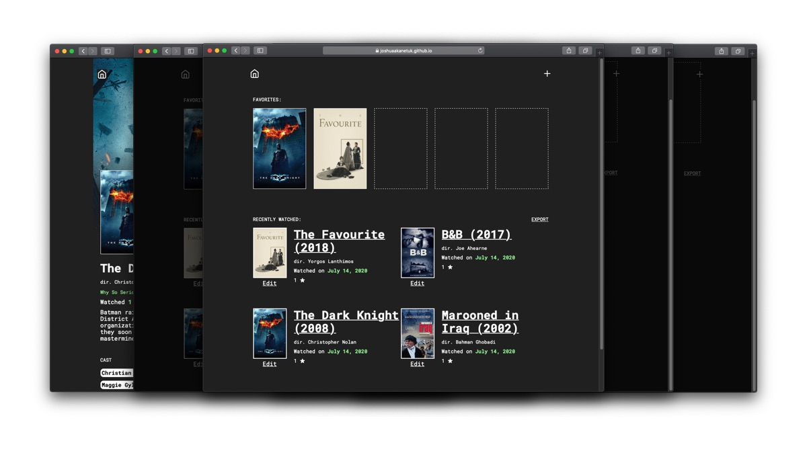

# Watched

 
<a href="">Live App</a>  🎬Log and track all of the movies you watch. 
 
 For movie and data fanatics.

## Motivation
Inspired by Letterboxd, I wanted a personal diary for movies and access to my database of watched movies.

## Features
- Add watched movies to a web based film diary.
- Create mini-reviews with every watch.
- Add up to 5 of your favorite movies.
- Get more details into your favorites.
- Export a list of your watched movies.

## Tech Stack
- HTML
- CSS
- Javascript
- JQuery
- TMDB API

## Copyright
Copyright 2020, Joshua Akan-Etuk. Film data from TMDb.

 

